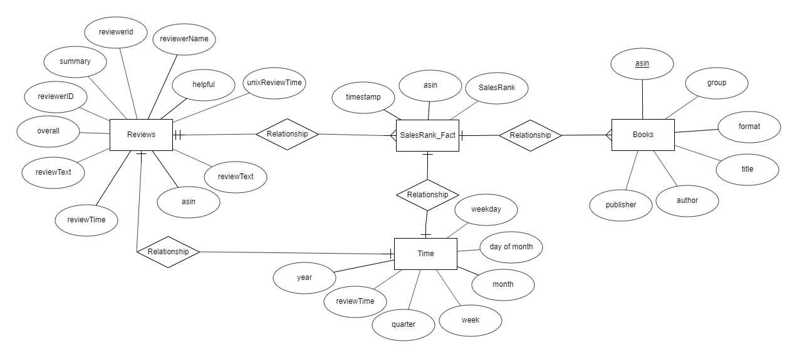

# Data Engineering Capstone Project

## Project Scope & The Data

I have chosen Amazon Kindle sales and review data, hosted on Kaggle based on the requirements of the project, namely - there must be 2 datasources (reviews and sales data), 2 formats (csv and json in this case), and the datasets must contain more than 1 million rows of data. 

Descriptive information on the 2 datasources can be found here:

https://www.kaggle.com/bharadwaj6/kindle-reviews
https://www.kaggle.com/ucffool/amazon-sales-rank-data-for-print-and-kindle-books

The two datasets can be modelled together based on the common identifier ASIN, which is Amazon's unique identifier.

The reviews data was created bu Julian McAuley from UCSD to support recommender systems research. http://jmcauley.ucsd.edu/data/amazon/ . 

### Purpose of the data model

I aim to model the data to support data analysis in areas such as:

- sentiment analysis of reviews
- analyse correlation of reviews and sales metrics
- highest rated and best selling kindle products.

My data analysis model will be a star schmea, to create flexiblity and simplicity for carrying out data analysis. 

## Exploratory Data Analysis

### Kindle Sales Data

The datasource consists of 2 csv files, with around 60-70k rows containing information about the books such as the identifier, the group, format, title, author and publisher. Data quality initially looks good. Some observations:

unique identifier contains no nulls and is unique
group, format, title, author and publisher all contain some missing values
not all book titles are unique
there is a large number of different publishers, the most common publisher published 4% of books.

Some rows contained double quotes within the double quoted fields which causes errors when loading using pandas, or into redshift. Because the analyis doesn't rely on every row of data and the number of rows affected was small, I decided to remove the rows in a pre processing step. 

### Sales Rank data 

66760 JSON files, with ASIN in their filename and timestamp and salesranks as key value pairs within the json.

To clean / prepare the data the asins need to be extracted from filename and created as a asin field within the data file.
This is difficult due to the number and size of the files. I 2 main approaches:

- In memory

I tried pandas and dask locally, but ran into local memory constraints. If processing speed was a process requirement, a distributed
computing environment with processing approaches such as spark or dask could provide the best solution.

In memory options are in 

- saving to disk

I looped through the files, reading, process and then writing them out, to reduce the strain on the RAM. The process is slow, but reliable.

### Kindle Reviews Data
The datasource consists of 1 csv file with kindle review data such as  ASIN, helpfullness of review, overall review, reviewtext review time etc.

It is a very large csv, with 983K rows. Some observations of the data:

ASIN is unique and contains no nulls
Some review text has been flagged as mismatched by kaggle
There are no missing values.
Review times range beteen March 2000 and July 2014, with most data in the 2013-14 period.

To clean the reviews data the index column needed to be removed.

- Document steps necessary to clean the data

## The Data Model

### TODO: Design and document the data model
- Map out the conceptual data model and explain why you chose that model

I have chosen a star schema, as it will support analysts to write analytical queries in less complex ways with less joins required. There is is some redundancy in the data as a consequence, which in this case is fine. In a web app backend I would 
normalize the data further, for example I would split reviewer id and name into a seperate table, to remove some redundancy.

### TODO: Plan ETL pipeline
# TODO: List the steps necessary to pipeline the data into the chosen data model
# TODO: add one more level of detail to the bullet points below
The major steps of the process are:

- downloading the data from the source
- pre processing / cleaning the data
- loading the data (to s3 and redshift)
- post load transformations

- Include this thinking for the project writeup:
# TODO: Clearly state the rationale for the choice of tools and technologies for the project.
*RUBRIC The choice of tools, technologies, and data model are justified well*
# TODO: Propose how often the data should be updated and why.

## The ETL pipeline

### TODO: Create the data pipelines and the data model
# create redshift db
# create tables
# load data
# transform

### TODO: Create a data dictionary
### TODO: Create and Run data quality checks to ensure the pipeline ran as expected
- Integrity constraints on the relational database (e.g., unique key, data type, etc.)
- Unit tests for the scripts to ensure they are doing the right thing
- Source/count checks to ensure completeness

## Project Writeup

- What's the goal? What queries will you want to run? How would Spark or Airflow be incorporated? Why did you choose the model you chose?
- Clearly state the rationale for the choice of tools and technologies for the project.
    *RUBRIC The choice of tools, technologies, and data model are justified well*
- Document the steps of the process.
- Propose how often the data should be updated and why.

## Scenarios

- If the data was increased by 100x.
- If the pipelines were run on a daily basis by 7am.
- If the database needed to be accessed by 100+ people.